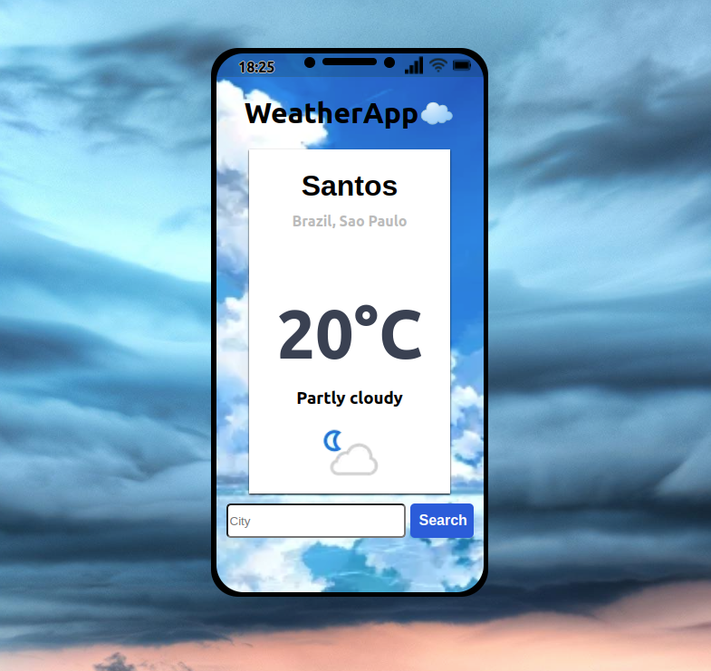

Bem vindo!

Fiz um app de tempo utilizando React junto com as APIs "https://openweathermap.org/api/geocoding-api" e "https://ipinfo.io/"

Site: https://weather-app-delta-sage.vercel.app/

Obrigado pela visita!
